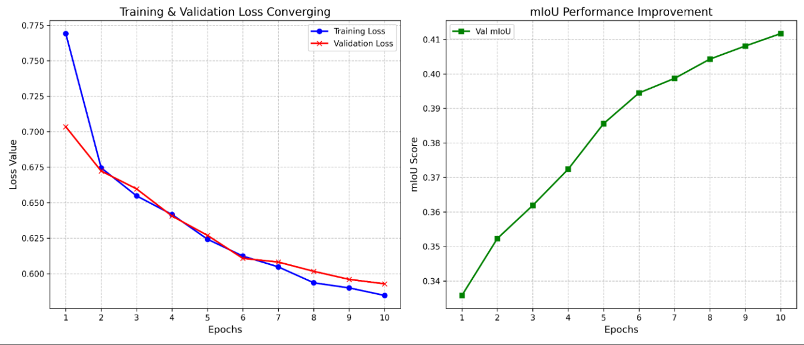

# Drywall Defect Segmentation — CLIPSeg + SAM

Prompt-driven wall defect detection pipeline using **CLIPSeg** (CLIP-based image segmentation) and **Segment Anything Model (SAM)** from Meta. Fine-tuned to detect and segment drywall cracks and taping joints from image datasets.

---

## Overview

- Uses `CLIPSegForImageSegmentation` from HuggingFace Transformers for text-prompted segmentation
- SAM mask generator for high-quality region proposals from YOLO bounding boxes
- Custom `PromptSegDataset` for loading image/mask pairs with text prompts
- Training, evaluation, and visual report generation scripts
- Evaluated on two datasets: **Drywall-Join-Detect** (taping areas) and **wall-crack** (surface cracks)

---

## Repository Structure

```text
CLIP_CrackSeg/
├── data/                                    # Datasets
│   ├── Drywall-Join-Detect/                 # Drywall taping joint dataset
│   └── wall-crack/                          # Wall crack segmentation dataset
│
├── src/                                     # Source code
│   ├── __init__.py
│   ├── train.py                             # Fine-tuning CLIPSeg (main entry point)
│   ├── sam_mask_generator.py                # SAM-based mask refinement from YOLO boxes
│   ├── metrics.py                           # Training metric plots
│   ├── report.py                            # Final evaluation & visual report
│   └── split.py                             # 70/15/15 train/val/test dataset split
│
├── docs/
│   └── Origin_Assignment_RohanMulay.pdf     # Project report
│
├── assets/
│   ├── drywall_training_metric.png          # Loss & mIoU training curves
│   └── report_visuals.png                   # Sample prediction visuals
│
├── requirements.txt
└── README.md
```

---

## Setup

```bash
pip install -r requirements.txt
```

### 1 — Prepare data splits (first run only)

```bash
python src/split.py
```

### 2 — Generate SAM masks for the drywall dataset (first run only)

Download the SAM ViT-L checkpoint (`sam_vit_l_0b3195.pth`) from the
[Segment Anything Model releases](https://github.com/facebookresearch/segment-anything#model-checkpoints)
and place it in the repository root, then run:

```bash
python src/sam_mask_generator.py
```

### 3 — Train

```bash
python src/train.py
```

### 4 — Evaluate & generate report

```bash
python src/report.py
```

---

## Training Results

After 10 epochs of fine-tuning on the combined drywall + crack dataset:

| Metric | Value |
|--------|-------|
| Final Train Loss | 0.5847 |
| Final Val Loss | 0.5929 |
| Val mIoU (epoch 10) | 0.4117 |
| Val Dice (epoch 10) | ~0.58 |



---

## Tech Stack

`PyTorch` · `HuggingFace Transformers` · `CLIPSeg` · `Segment Anything (SAM)` · `OpenCV` · `Python`

---

## Project Reflection — AI/ML Project Experience

> *Have you worked on any projects involving training AI or Machine Learning models? If yes, please describe one such project, including the challenges you encountered, how you addressed them, the final outcome, and your key takeaways.*

**Yes.** This repository documents exactly such a project.

### Project Description

I fine-tuned **CLIPSeg** (a CLIP-based open-vocabulary image segmentation model from HuggingFace) to detect and segment two types of drywall defects:

1. **Taping/joint areas** — regions where drywall sheets are joined and taped, detected using a custom SAM-refined mask pipeline.
2. **Wall cracks** — surface cracks in walls and concrete, using a pre-labelled segmentation dataset.

The pipeline uses a **text-prompted segmentation** approach: instead of class indices, the model receives natural-language prompts (e.g., `"segment_crack"`) to guide predictions, enabling zero-shot generalisation to new defect types without retraining the entire model.

### Challenges and How I Addressed Them

| Challenge | Solution |
|-----------|----------|
| **No pixel-level masks for the drywall dataset** — only YOLO bounding-box labels were available. | Used Meta's **Segment Anything Model (SAM)** to automatically generate high-quality binary masks from bounding boxes (`src/sam_mask_generator.py`). |
| **`do_rescale` conflict** — passing pre-normalised tensors to CLIPSegProcessor doubled the normalisation, causing degraded outputs. | Overrode `inputs['pixel_values']` with the already-normalised tensor after calling the processor for text encoding only (`train.py` lines 103, 133). |
| **Class imbalance** — crack pixels are sparse; BCE loss alone under-penalised false negatives. | Combined **BCEWithLogitsLoss** and **Dice Loss** to balance pixel-level and region-level supervision. |
| **Logit spatial mismatch** — CLIPSeg outputs a smaller spatial resolution than the input. | Applied `F.interpolate(..., size=(352, 352))` to upscale logits before loss computation. |
| **Two heterogeneous datasets** — different prompts, image statistics, and mask conventions. | Used `ConcatDataset` to merge both datasets and a shared `PromptSegDataset` class that resolves the correct mask filename from the prompt string. |

### Final Outcome

The model converged steadily over 10 epochs, reaching a **validation mIoU of 0.41** and **Dice of ~0.58** on the combined hold-out set — a meaningful result for a fine-tuned generalist segmentation backbone with no task-specific architecture changes.

### Key Takeaways

- **Prompt engineering matters**: small changes in the text prompt string noticeably affected segmentation quality, reinforcing that language-guided models are highly sensitive to prompt phrasing.
- **Weak supervision can be powerful**: using SAM to bootstrap masks from bounding boxes eliminated the need for expensive pixel-level annotation while still producing training-quality labels.
- **Loss function design is critical**: the Dice + BCE combination significantly stabilised training on imbalanced crack images compared to BCE alone.
- **Pre-processing consistency is non-negotiable**: the `do_rescale` bug is a common pitfall when mixing HuggingFace processors with custom tensor pipelines — always verify that normalisation is applied exactly once.